# Hotel Price Scraper

A Python project for scraping hotel prices from Booking.com. This scraper can extract price information, hotel details, and booking dates from Booking.com hotel pages.

## Features

- 🏨 Extract hotel name, address, and rating
- 💰 Get current pricing information
- 📅 Extract check-in/check-out dates
- 🌙 Number of nights calculation
- 🤖 Handles anti-bot measures with Selenium
- 📝 Comprehensive logging
- 🛡️ Error handling and retry logic

## AWS Architecture

This project is designed to run on AWS infrastructure with the following components:

### Architecture Diagram

```mermaid
graph TB
    subgraph "AWS Cloud - eu-west-1"
        subgraph "VPC"
            subgraph "Public Subnet"
                EC2["🖥️ EC2 Instance<br/>Amazon Linux 2023<br/>t3.medium<br/>Public IP<br/>Python + Chrome + NordVPN<br/>Hotel Scraper App"]
            end
            
            subgraph "Private Subnet Group"
                RDS["🗄️ RDS MySQL 8.0<br/>scraper.clyuc4e6ci6m.eu-west-1.rds.amazonaws.com<br/>Multi-AZ Deployment<br/>IAM Database Auth<br/>SSL/TLS Encryption<br/>Database: hotel_scraper"]
            end
            
            SG_EC2["🛡️ EC2 Security Group<br/>Outbound: HTTPS (443)<br/>Outbound: MySQL (3306)<br/>No SSH (22) inbound<br/>SSM access only"]
            
            SG_RDS["🛡️ RDS Security Group<br/>Inbound: MySQL (3306)<br/>from EC2 SG only"]
        end
        
        S3["🪣 S3 Bucket<br/>apartmentscreenshots<br/>📁 hotel-scraper/YYYY/MM/DD/<br/>🗑️ 5-day lifecycle policy<br/>🔒 AES-256 encryption<br/>❌ Versioning disabled"]
        
        IAM["👤 Single IAM Role<br/>HotelScraperEC2Role<br/>📋 Inline Policies:<br/>• RDS connect<br/>• S3 upload<br/>• CloudWatch logs<br/>• SSM access"]
        
        CW["📊 CloudWatch<br/>📝 Log Groups:<br/>/aws/ec2/hotel-scraper<br/>📈 Metrics & Alarms<br/>🚨 Error monitoring"]
        
        SSM["🔧 Systems Manager<br/>🖥️ Session Manager<br/>⚡ Run Command<br/>🔐 Parameter Store<br/>🔄 Patch Manager"]
        
        IGW["🌐 Internet Gateway"]
    end
    
    subgraph "External Services"
        BOOKING["🏨 Booking.com<br/>Hotel data & pricing<br/>Screenshots"]
        VPN["🌐 NordVPN<br/>Multiple countries<br/>IP rotation"]
        IP_SERVICES["🌍 IP Services<br/>ipinfo.io<br/>api.ipify.org<br/>checkip.amazonaws.com"]
    end
    
    %% Internal AWS connections
    EC2 ---|"MySQL (3306)<br/>IAM Auth + SSL"| RDS
    EC2 ---|"Upload screenshots<br/>S3 API"| S3
    EC2 ---|"Application logs<br/>Metrics"| CW
    SSM ---|"Secure shell access<br/>No SSH keys"| EC2
    IAM ---|"Permissions"| EC2
    EC2 --- SG_EC2
    RDS --- SG_RDS
    
    %% Internet connections
    EC2 ---|"HTTPS (443)"| IGW
    IGW ---|"Scraping requests"| BOOKING
    IGW ---|"VPN connection"| VPN
    IGW ---|"IP detection"| IP_SERVICES
    
    %% Styling
    classDef awsService fill:#FF9900,stroke:#232F3E,stroke-width:2px,color:#fff
    classDef external fill:#4CAF50,stroke:#2E7D32,stroke-width:2px,color:#fff
    classDef security fill:#F44336,stroke:#C62828,stroke-width:2px,color:#fff
    classDef storage fill:#2196F3,stroke:#1565C0,stroke-width:2px,color:#fff
    
    class EC2,RDS,IAM,CW,SSM,IGW awsService
    class BOOKING,VPN,IP_SERVICES external
    class SG_EC2,SG_RDS security
    class S3 storage
```



## Installation

### Option 1: Automatic Setup (Recommended)

Run the setup script to automatically create a virtual environment and install dependencies:

```bash
chmod +x setup.sh
./setup.sh
```

### Option 2: Manual Setup

1. Create a virtual environment:
```bash
python3 -m venv venv
```

2. Activate the virtual environment:
```bash
source venv/bin/activate
```

3. Install dependencies:
```bash
pip install -r requirements.txt
```

### Activating the Environment

Before running the scraper, always activate the virtual environment:

```bash
source venv/bin/activate
```

When you're done, deactivate it:

```bash
deactivate
```

## Usage

### Basic Usage

```python
from hotel_scraper import BookingHotelScraper

# Create scraper instance
with BookingHotelScraper(headless=True) as scraper:
    result = scraper.scrape_hotel_price("https://www.booking.com/hotel/...")
    print(result)
```

### Run the Example

The project includes an example that scrapes the Goodview Serviced Apartment in New Zealand:

```bash
python example_usage.py
```

### Multi-Country Price Comparison

For advanced users with NordVPN, you can compare hotel prices across different countries:

```bash
./run_multi_country_scraper.sh
```

**Requirements for Multi-Country Scraping:**
- NordVPN subscription and CLI installed
- Must be logged into NordVPN (`nordvpn login`)
- Stable internet connection

This will:
- Connect to multiple countries via NordVPN
- Scrape the same hotel from each location
- Compare pricing differences by region
- Generate CSV and JSON reports
- Take screenshots for verification

## Sample Output

```json
{
  "hotel_name": "Goodview Serviced Apartment",
  "address": "Auckland, New Zealand",
  "rating": "8.5",
  "raw_price": "NZ$2,356",
  "cleaned_price": 2356.0,
  "checkin_date": "Sat 8 Mar 2026",
  "checkout_date": "Sun 22 Mar 2026",
  "nights": "14 nights",
  "scraped_at": "2024-10-27T19:30:00.000000",
  "url": "https://www.booking.com/hotel/..."
}
```

## Requirements

- Python 3.7+
- Chrome browser (for Selenium WebDriver)
- Internet connection

## Notes

- The scraper uses Selenium with Chrome WebDriver for better compatibility with dynamic content
- Includes anti-detection measures to avoid being blocked
- Respects website's robots.txt and rate limiting
- For educational and personal use only

## Disclaimer

This tool is for educational purposes only. Please respect Booking.com's terms of service and use responsibly. Consider using official APIs when available for production use.
